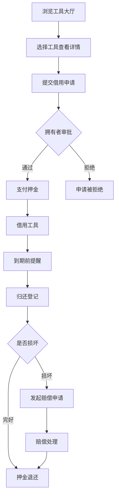
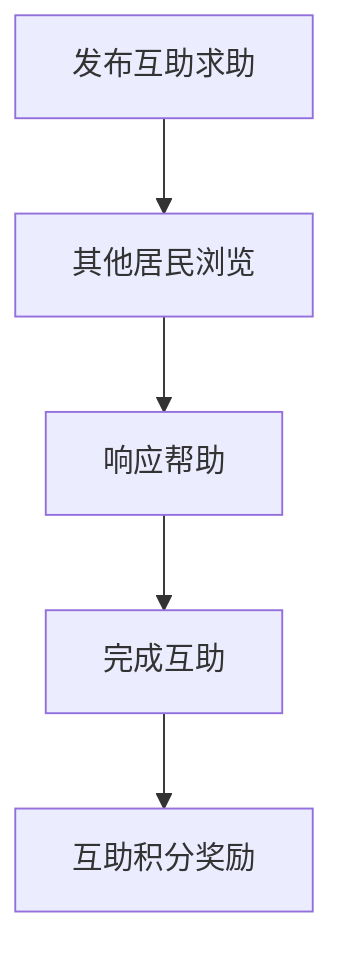

## 1. 产品概述
温馨邻里社区工具共享与互助平台——一个以"邻里互助、资源共享"为核心理念的社区工具共享全栈平台，让社区居民可以方便地发布、借用、归还工具，同时支持押金托管、损坏赔偿、互助求助等邻里互助场景，构建温暖可信的社区共享生态。
- 解决社区居民工具闲置与临时需求不匹配的问题，降低生活成本，增进邻里关系
- 目标用户为城市社区/小区居民，提供安全可信的工具借用与互助服务

## 2. 核心功能

### 2.1 用户角色
| 角色 | 注册方式 | 核心权限 |
|------|----------|----------|
| 居民用户 | 手机号/邮箱注册 | 发布工具、借用申请、互助求助、查看公告 |
| 管理员 | 后台指定 | 用户管理、工具审核、违规处理、数据统计 |

### 2.2 功能模块
1. **首页**：社区公告轮播、热门工具推荐、最新互助求助、社区贡献排行榜
2. **工具大厅**：工具分类检索、工具列表、工具详情、借用申请
3. **我的借用**：借用记录、归还登记、到期提醒
4. **互助广场**：邻里互助求助发布、求助列表、响应帮助
5. **公告栏**：社区公告、通知消息
6. **个人中心**：我的工具、借用历史、押金管理、消息通知、贡献积分
7. **后台管理**：用户管理、工具审核、违规处理、活跃度统计

### 2.3 页面详情
| 页面名称 | 模块名称 | 功能描述 |
|----------|----------|----------|
| 首页 | 公告轮播 | 展示最新社区公告，自动轮播切换 |
| 首页 | 热门工具推荐 | 展示借用次数最多的工具卡片 |
| 首页 | 最新互助求助 | 展示最近发布的互助求助信息 |
| 首页 | 贡献排行榜 | 展示社区贡献积分排名前10的用户 |
| 工具大厅 | 分类筛选 | 按工具类别（电动工具、家用工具、户外装备等）筛选 |
| 工具大厅 | 搜索框 | 按关键词搜索工具 |
| 工具大厅 | 工具卡片列表 | 展示工具图片、名称、状态标签、押金、发布者 |
| 工具详情 | 工具信息 | 工具名称、描述、图片、分类、押金金额、状态 |
| 工具详情 | 借用申请 | 选择借用时间段，提交借用申请 |
| 工具详情 | 发布者信息 | 展示工具发布者头像、昵称、信誉评分 |
| 我的借用 | 进行中借用 | 展示当前借用的工具，归还按钮，到期倒计时 |
| 我的借用 | 历史借用 | 展示已归还/已过期的借用记录 |
| 我的借用 | 到期提醒 | 借用到期前自动提醒通知 |
| 互助广场 | 求助列表 | 展示邻里互助求助信息，支持筛选 |
| 互助广场 | 发布求助 | 填写求助标题、描述、联系方式 |
| 互助广场 | 响应帮助 | 对求助信息进行响应 |
| 公告栏 | 公告列表 | 展示社区公告列表 |
| 公告栏 | 公告详情 | 展示公告全文 |
| 个人中心 | 我的工具 | 管理已发布的工具，查看借用情况 |
| 个人中心 | 借用历史 | 查看所有借用记录 |
| 个人中心 | 押金管理 | 查看押金托管状态，退款进度 |
| 个人中心 | 消息通知 | 系统通知、借用通知、到期提醒 |
| 个人中心 | 损坏赔偿 | 提交损坏赔偿申请，查看处理进度 |
| 后台管理-用户 | 用户列表 | 查看所有用户，禁用/启用账户 |
| 后台管理-工具 | 工具审核 | 审核新发布的工具，通过/拒绝 |
| 后台管理-违规 | 违规处理 | 处理用户举报，违规工具下架 |
| 后台管理-统计 | 活跃度统计 | 社区活跃度趋势图、工具借用统计 |

## 3. 核心流程

**工具借用流程**：居民浏览工具大厅 → 选择工具查看详情 → 提交借用申请（含借用时间） → 工具拥有者审批 → 支付押金 → 借用工具 → 到期前提醒 → 归还登记 → 押金退还 → 若有损坏则发起赔偿申请

**互助求助流程**：居民发布求助 → 其他居民浏览 → 响应帮助 → 完成互助 → 互助积分奖励

## 4. 用户界面设计

### 4.1 设计风格
- **主色调**：暖橙（#E8763A）作为强调色，米白（#FDF6EC）作为背景色，浅棕（#B8956A）作为辅助色
- **辅助色**：淡黄（#FFF3D6）卡片背景、深棕（#5C3D2E）文字色、柔和绿（#7CB342）成功/可用状态
- **按钮风格**：圆角8px，暖橙主按钮带微弱阴影，浅棕次要按钮
- **字体**：标题使用"ZCOOL XiaoWei"（站酷小薇），正文使用"Noto Sans SC"
- **布局风格**：顶部导航栏 + 卡片式内容布局，左侧图标导航
- **图标风格**：线性简笔画风格，工具箱、房屋、锤子、梯子等邻里元素装饰
- **装饰元素**：页面角落工具箱/房屋简笔画SVG装饰，卡片顶部浅棕色条纹装饰

### 4.2 页面设计概览
| 页面名称 | 模块名称 | UI元素 |
|----------|----------|--------|
| 首页 | 公告轮播 | 米白背景，暖橙轮播指示器，卡片圆角12px，淡黄卡片背景 |
| 首页 | 热门工具 | 工具卡片网格，左上角分类标签，暖橙状态标签 |
| 首页 | 贡献排行 | 浅棕边框卡片，暖橙排名标记，奖杯图标 |
| 工具大厅 | 筛选区 | 分类标签按钮组，选中态暖橙底色，搜索框圆角 |
| 工具大厅 | 工具列表 | 工具图片+信息卡片，状态标签颜色区分 |
| 工具详情 | 详情区 | 大图展示，借用时间选择器，暖橙申请按钮 |
| 我的借用 | 借用列表 | 时间轴样式，到期倒计时暖橙闪烁提醒 |
| 互助广场 | 求助卡片 | 浅棕边框卡片，紧急程度标签，响应人数指示 |
| 个人中心 | 侧边导航 | 左侧图标菜单，当前项暖橙高亮 |
| 后台管理 | 统计面板 | 数据卡片+折线图，暖橙渐变柱状图 |

### 4.3 响应式设计
- 桌面端优先设计（1200px+），平板（768px-1199px）自适应卡片列数，移动端（<768px）单列布局 + 底部导航

### 4.4 3D场景
- 不适用，本项目为2D平面设计
