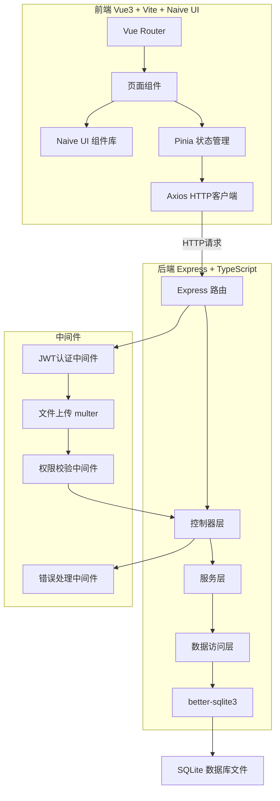
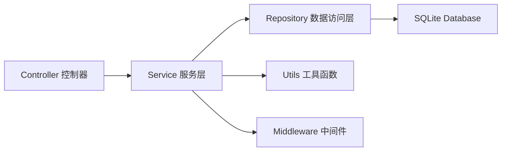
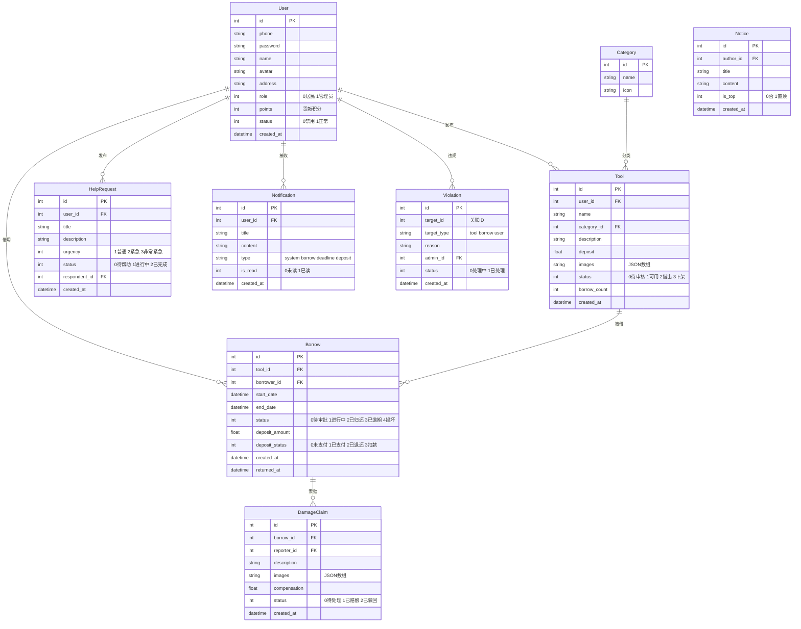

## 1. 架构设计



## 2. 技术说明
- **前端**：Vue3@3 + Naive UI@2 + Vite@5 + Pinia + Vue Router@4 + Tailwind CSS@3
- **初始化工具**：vite-init (vue-express-ts 模板)
- **后端**：Express@4 + TypeScript + better-sqlite3 + multer + jsonwebtoken + bcryptjs
- **数据库**：SQLite（better-sqlite3 驱动，数据文件存储在 server/data/ 目录）
- **图标库**：lucide-vue-next
- **HTTP 客户端**：axios

## 3. 路由定义
| 路由 | 用途 |
|------|------|
| `/` | 首页 - 社区公告、热门工具、互助求助、贡献排行 |
| `/tools` | 工具大厅 - 工具分类检索、搜索、列表 |
| `/tools/:id` | 工具详情 - 工具信息、借用申请 |
| `/borrows` | 我的借用 - 进行中借用、历史记录 |
| `/help` | 互助广场 - 求助列表、发布求助 |
| `/notices` | 公告栏 - 社区公告列表 |
| `/notices/:id` | 公告详情 |
| `/profile` | 个人中心 - 我的工具、借用历史、押金、消息 |
| `/publish` | 发布工具 |
| `/admin` | 后台管理 - 用户、审核、违规、统计 |

## 4. API 定义

### 4.1 认证相关
```
POST   /api/auth/register    注册 { phone, password, name, address }
POST   /api/auth/login       登录 { phone, password }
GET    /api/auth/profile     获取当前用户信息
PUT    /api/auth/profile     更新用户信息
```

### 4.2 工具相关
```
GET    /api/tools             获取工具列表（支持分类、关键词、状态筛选）
GET    /api/tools/:id         获取工具详情
POST   /api/tools             发布工具 { name, category, description, deposit, images }
PUT    /api/tools/:id         更新工具信息
DELETE /api/tools/:id         删除工具
PUT    /api/tools/:id/status  更新工具状态
```

### 4.3 借用相关
```
POST   /api/borrows           提交借用申请 { toolId, startDate, endDate }
GET    /api/borrows            获取借用列表（支持状态筛选）
PUT    /api/borrows/:id/approve 审批借用申请 { approved }
PUT    /api/borrows/:id/return  归还登记
POST   /api/borrows/:id/damage  损坏赔偿申请 { description, images }
```

### 4.4 押金相关
```
POST   /api/deposits/pay      支付押金 { borrowId, amount }
POST   /api/deposits/refund   申请退还押金 { borrowId }
GET    /api/deposits           获取押金记录
```

### 4.5 互助相关
```
GET    /api/help-requests      获取求助列表
POST   /api/help-requests      发布求助 { title, description, urgency }
POST   /api/help-requests/:id/respond  响应求助
PUT    /api/help-requests/:id/complete  完成互助
```

### 4.6 公告相关
```
GET    /api/notices            获取公告列表
GET    /api/notices/:id        获取公告详情
POST   /api/notices            发布公告（管理员）
```

### 4.7 消息通知
```
GET    /api/notifications      获取通知列表
PUT    /api/notifications/:id/read  标记已读
GET    /api/notifications/unread    未读数量
```

### 4.8 后台管理
```
GET    /api/admin/users        用户列表
PUT    /api/admin/users/:id    更新用户状态
GET    /api/admin/tools/pending 待审核工具
PUT    /api/admin/tools/:id/audit  审核工具 { approved, reason }
POST   /api/admin/violations   违规处理 { targetId, type, reason }
GET    /api/admin/stats        活跃度统计数据
GET    /api/admin/rankings     贡献排行榜
```

### 4.9 文件上传
```
POST   /api/upload             上传图片（multipart/form-data）
```

## 5. 服务器架构图



## 6. 数据模型

### 6.1 数据模型定义



### 6.2 数据定义语言

```sql
CREATE TABLE IF NOT EXISTS users (
  id INTEGER PRIMARY KEY AUTOINCREMENT,
  phone TEXT NOT NULL UNIQUE,
  password TEXT NOT NULL,
  name TEXT NOT NULL,
  avatar TEXT DEFAULT '',
  address TEXT DEFAULT '',
  role INTEGER DEFAULT 0,
  points INTEGER DEFAULT 0,
  status INTEGER DEFAULT 1,
  created_at TEXT DEFAULT (datetime('now'))
);

CREATE TABLE IF NOT EXISTS categories (
  id INTEGER PRIMARY KEY AUTOINCREMENT,
  name TEXT NOT NULL,
  icon TEXT DEFAULT ''
);

CREATE TABLE IF NOT EXISTS tools (
  id INTEGER PRIMARY KEY AUTOINCREMENT,
  user_id INTEGER NOT NULL REFERENCES users(id),
  name TEXT NOT NULL,
  category_id INTEGER REFERENCES categories(id),
  description TEXT DEFAULT '',
  deposit REAL DEFAULT 0,
  images TEXT DEFAULT '[]',
  status INTEGER DEFAULT 0,
  borrow_count INTEGER DEFAULT 0,
  created_at TEXT DEFAULT (datetime('now'))
);

CREATE TABLE IF NOT EXISTS borrows (
  id INTEGER PRIMARY KEY AUTOINCREMENT,
  tool_id INTEGER NOT NULL REFERENCES tools(id),
  borrower_id INTEGER NOT NULL REFERENCES users(id),
  start_date TEXT NOT NULL,
  end_date TEXT NOT NULL,
  status INTEGER DEFAULT 0,
  deposit_amount REAL DEFAULT 0,
  deposit_status INTEGER DEFAULT 0,
  created_at TEXT DEFAULT (datetime('now')),
  returned_at TEXT
);

CREATE TABLE IF NOT EXISTS damage_claims (
  id INTEGER PRIMARY KEY AUTOINCREMENT,
  borrow_id INTEGER NOT NULL REFERENCES borrows(id),
  reporter_id INTEGER NOT NULL REFERENCES users(id),
  description TEXT NOT NULL,
  images TEXT DEFAULT '[]',
  compensation REAL DEFAULT 0,
  status INTEGER DEFAULT 0,
  created_at TEXT DEFAULT (datetime('now'))
);

CREATE TABLE IF NOT EXISTS help_requests (
  id INTEGER PRIMARY KEY AUTOINCREMENT,
  user_id INTEGER NOT NULL REFERENCES users(id),
  title TEXT NOT NULL,
  description TEXT NOT NULL,
  urgency INTEGER DEFAULT 1,
  status INTEGER DEFAULT 0,
  respondent_id INTEGER REFERENCES users(id),
  created_at TEXT DEFAULT (datetime('now'))
);

CREATE TABLE IF NOT EXISTS notices (
  id INTEGER PRIMARY KEY AUTOINCREMENT,
  author_id INTEGER NOT NULL REFERENCES users(id),
  title TEXT NOT NULL,
  content TEXT NOT NULL,
  is_top INTEGER DEFAULT 0,
  created_at TEXT DEFAULT (datetime('now'))
);

CREATE TABLE IF NOT EXISTS notifications (
  id INTEGER PRIMARY KEY AUTOINCREMENT,
  user_id INTEGER NOT NULL REFERENCES users(id),
  title TEXT NOT NULL,
  content TEXT NOT NULL,
  type TEXT DEFAULT 'system',
  is_read INTEGER DEFAULT 0,
  created_at TEXT DEFAULT (datetime('now'))
);

CREATE TABLE IF NOT EXISTS violations (
  id INTEGER PRIMARY KEY AUTOINCREMENT,
  target_id INTEGER NOT NULL,
  target_type TEXT NOT NULL,
  reason TEXT NOT NULL,
  admin_id INTEGER NOT NULL REFERENCES users(id),
  status INTEGER DEFAULT 0,
  created_at TEXT DEFAULT (datetime('now'))
);

INSERT INTO categories (name, icon) VALUES
  ('电动工具', 'zap'),
  ('家用工具', 'home'),
  ('户外装备', 'tent'),
  ('园林工具', 'flower-2'),
  ('维修工具', 'wrench'),
  ('其他', 'package');
```
